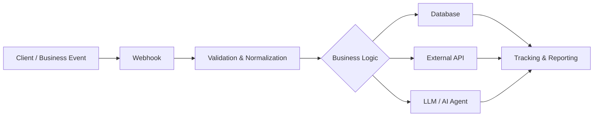

# AI Automation Portfolio

### Public technical showcase by Ali Alteibe

This repository is a sanitized engineering portfolio for **AI Automation, Integration Development, and LLM Application** roles.

It demonstrates the patterns I use in real business automation work without exposing private customer data, production credentials, or company secrets.

## What this portfolio shows

- n8n-style workflow design
- REST API and webhook integration
- TypeScript data processing and validation
- Supabase/PostgreSQL schema design
- WhatsApp-style campaign pipeline patterns
- LLM application and RAG architecture examples
- security and secret-management practices
- production-minded error handling and observability concepts

## Architecture



## Repository structure

```text
examples/
  api/
    webhook-handler.ts
    external-api-client.ts
  data/
    saudi-phone-normalizer.ts
  llm/
    structured-agent.ts
  rag/
    retrieval-pipeline.md
n8n/
  sample-campaign-workflow.json
supabase/
  schema.sql
SECURITY.md
.env.example
```

## Featured example: Campaign Automation Flow

```text
Webhook / Schedule
      |
      v
Validate Payload
      |
      v
Load Eligible Recipients
      |
      v
Apply Business Rules
      |
      +----> Skip opted-out / invalid recipients
      |
      v
Build API Payload
      |
      v
Send / Simulate
      |
      v
Store Delivery State
      |
      v
Reporting / Retry Queue
```

This mirrors the type of integration work I have done on a private production-oriented WhatsApp campaign system using n8n, Supabase/PostgreSQL, Next.js, TypeScript, webhooks, and Meta/WhatsApp APIs.

## Engineering principles

1. **No secrets in source control.** Credentials belong in environment variables or a secret manager.
2. **Validate at boundaries.** Webhook and API payloads are treated as untrusted input.
3. **Business rules are explicit.** Eligibility, consent, opt-out, and state transitions should be testable.
4. **Retries must be safe.** Idempotency prevents accidental duplicate work.
5. **Databases do real database work.** Large filtering/counting jobs should run in PostgreSQL instead of fetching everything into JavaScript.
6. **AI output is not trusted blindly.** Structured outputs, validation, guardrails, and human approval are used when appropriate.

## Stack

`n8n` · `REST APIs` · `Webhooks` · `TypeScript` · `JavaScript` · `Next.js` · `Supabase` · `PostgreSQL` · `SQL` · `LLM APIs` · `RAG` · `Git/GitHub`

## About my development process

I use AI-assisted development tools such as Claude and ChatGPT to accelerate implementation, but I focus on understanding the architecture, workflow logic, integration behavior, testing, and debugging behind the result.

My current goal is to deepen the fundamentals needed for professional AI Automation / Integration / LLM Application roles in Saudi Arabia.

## Contact

**Ali Alteibe**  
Dammam, Saudi Arabia  
Email: alialteibe@gmail.com  
LinkedIn: https://www.linkedin.com/in/ali-alteybe-49494533b
